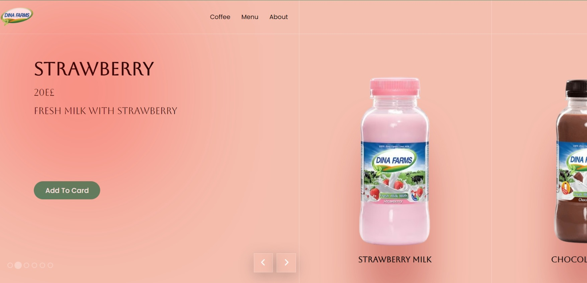

# Custom Image Slider for Dina Farms Milk Products

This project is a fully customizable image slider that lets you easily change the number of images to suit any product lineup. For this version, I’ve chosen Dina Farms' milk products because, well, who doesn’t love a good bottle of milk? 🥛💚

## Preview:

## Features:

- Customizable Image Count: Adjust the slider to display as many (or as few) images as you like 
– perfect for any product range.
- Automatic Slideshow: Sit back and watch as the slider automatically transitions through the products.
- Manual Controls: Feeling in control? Use the next and previous buttons to navigate through the slider at your own pace.
- Smooth Transitions: Enjoy seamless transitions that make browsing products a breeze.
- Responsive Design: Works great on mobile, tablet, and desktop screens, so no one misses out on the fun!

## Technologies Used:

- HTML
- CSS
- JavaScript

## Project Demo

A demo of the project is available here:ayahany0.github.io/ImageSlider/
